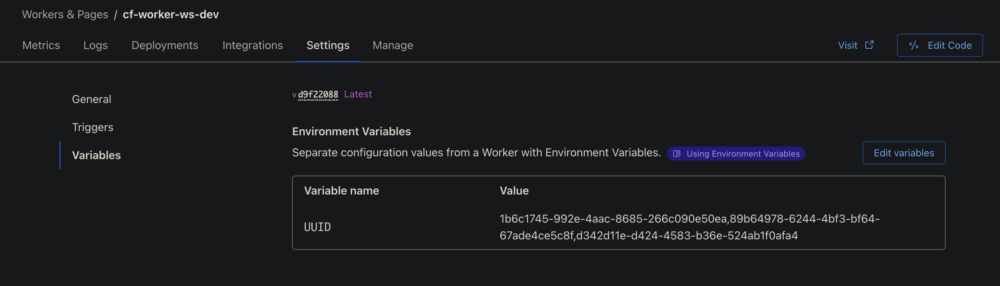
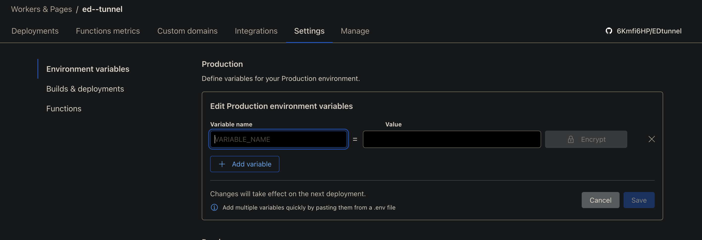

# EDtunnel

<p align="center">
  
</p>

EDtunnel 是一个基于 Cloudflare Workers 和 Pages 的代理工具，支持多种协议和配置选项。

EDtunnel is a proxy tool based on Cloudflare Workers and Pages, supporting multiple protocols and configuration options.

[](https://github.com/6Kmfi6HP/EDtunnel)
[](https://t.me/edtunnel)

## ✨ 特性 | Features

- 支持 Cloudflare Workers 和 Pages 部署
- 支持多 UUID 配置
- 支持自定义代理 IP 和端口
- 支持 SOCKS5 代理
- 提供自动配置订阅链接
- 简单易用的部署流程

- Support for Cloudflare Workers and Pages deployment
- Multiple UUID configuration support
- Custom proxy IP and port support
- SOCKS5 proxy support
- Automatic configuration subscription link
- Simple and easy deployment process

## 🚀 快速部署 | Quick Deployment

### 在 Pages.dev 部署 | Deploy on Pages.dev

1. 观看部署教程视频 | Watch deployment tutorial video：
   [YouTube Tutorial](https://www.youtube.com/watch?v=8I-yTNHB0aw)

2. 克隆此仓库并在 Cloudflare Pages 中部署 | Clone this repository and deploy in Cloudflare Pages

### 在 Worker.dev 部署 | Deploy on Worker.dev

1. 从[这里](https://github.com/6Kmfi6HP/EDtunnel/blob/main/_worker.js)复制 `_worker.js` 代码 | Copy `_worker.js` code from [here](https://github.com/6Kmfi6HP/EDtunnel/blob/main/_worker.js)

2. 或者点击下方按钮一键部署 | Or click the button below to deploy directly:

   [](https://deploy.workers.cloudflare.com/?url=https://github.com/6Kmfi6HP/EDtunnel)

## ⚙️ 配置说明 | Configuration Guide

### 环境变量配置 | Environment Variables

| 变量名 (Variable) | 是否必需 (Required) | 示例 (Example) | 说明 (Description) |
|------------------|-------------------|---------------|-------------------|
| `UUID` | 否 (No) | 单个 (Single): `12345678-1234-1234-1234-123456789012`<br>多个 (Multiple): `uuid1,uuid2,uuid3` | 用户识别码 / User identification |
| `PROXYIP` | 否 (No) | `1.1.1.1` 或 (or) `example.com`<br>多个 (Multiple): `1.1.1.1:9443,2.2.2.2:8443` | 自定义代理IP和端口 / Custom proxy IP and port |
| `SOCKS5` | 否 (No) | `user:pass@host:port`<br>多个 (Multiple): `user1:pass1@host1:port1,user2:pass2@host2:port2` | SOCKS5代理配置 / SOCKS5 proxy configuration |
| `SOCKS5_RELAY` | 否 (No) | `true` 或 (or) `false` | 启用SOCKS5流量转发 / Enable SOCKS5 traffic relay |

### 非443端口配置 | Non-443 Port Configuration

1. 访问 (Visit) `https://proxyip.edtunnel.best/`
2. 输入 (Enter) `ProxyIP:proxyport` 并点击检查 (and click Check)
3. 当显示 (When showing) `Proxy IP: true` 时可用 (it's available)
4. 在 Worker 中配置 (Configure in Worker): `PROXYIP=211.230.110.231:50008`

注意：带端口的代理IP可能在某些仅支持HTTP的Cloudflare站点上无效。
Note: Proxy IPs with ports may not work on HTTP-only Cloudflare sites.

### UUID 配置方法 | UUID Configuration

#### 方法一 | Method 1
在 `wrangler.toml` 文件中设置（不推荐在公共仓库中使用）
Set in `wrangler.toml` file (not recommended for public repositories)

```toml
[vars]
UUID = "your-uuid-here"
```

#### 方法二 | Method 2
在 Cloudflare Dashboard 的环境变量中设置（推荐方式）
Set in Cloudflare Dashboard environment variables (recommended method)

## ⚠️ 重要提示：多项配置分隔符 | Important Note: Multiple Configuration Separator

所有多项配置必须使用英文逗号(,)分隔，不能使用中文逗号(，)
All multiple configurations MUST use English comma(,) as separator, NOT Chinese comma(，)

✅ 正确示例 | Correct Examples:
```bash
# UUID多个配置 | Multiple UUID
UUID=uuid1,uuid2,uuid3

# SOCKS5多个代理 | Multiple SOCKS5 proxies
SOCKS5=192.168.1.1:1080,192.168.1.2:1080

# PROXYIP多个地址 | Multiple PROXYIP
PROXYIP=1.1.1.1:443,2.2.2.2:443
```

❌ 错误示例 | Wrong Examples:
```bash
# 错误：使用中文逗号 | Wrong: Using Chinese comma
UUID=uuid1，uuid2，uuid3

# 错误：使用中文逗号 | Wrong: Using Chinese comma
SOCKS5=192.168.1.1:1080，192.168.1.2:1080
```

## 📱 快速使用 | Quick Start

### 自动配置订阅 | Auto Configuration Subscribe

使用以下链接获取自动配置 | Use the following link for auto configuration:
```
https://sub.xf.free.hr/auto
```

### 查看配置 | View Configuration

- 访问您的域名 | Visit your domain: `https://your-domain.pages.dev`
- 使用特定UUID | Use specific UUID: `/sub/[uuid]`
- 查看完整配置 | View full configuration: 直接访问域名根路径 (visit domain root path)
- 获取订阅内容 | Get subscription content: 访问 `/sub/[uuid]` (visit `/sub/[uuid]`)

## 🔧 高级配置 | Advanced Configuration

### 多UUID支持 | Multiple UUID Support

您可以通过以下方式配置多个UUID | You can configure multiple UUIDs in these ways:

1. 环境变量方式 | Via environment variables:
   ```
   UUID=uuid1,uuid2,uuid3
   ```

2. 配置文件方式 | Via configuration file:
   ```toml
   [vars]
   UUID = "uuid1,uuid2,uuid3"
   ```

### SOCKS5代理配置 | SOCKS5 Proxy Configuration

支持以下格式 | Supports the following formats:
- 基础格式 | Basic format: `host:port`
- 认证格式 | Authentication format: `username:password@host:port`
- 多代理格式（使用英文逗号分隔）| Multiple proxies (separated by English comma): `proxy1,proxy2,proxy3`

#### 配置示例 | Configuration Examples:

1. 单个代理 | Single Proxy:
```bash
# 基础格式 | Basic format
SOCKS5=192.168.1.1:1080

# 带认证格式 | With authentication
SOCKS5=user:pass@192.168.1.1:1080
```

2. 多个代理（使用英文逗号分隔）| Multiple Proxies (separated by English comma):
```bash
# 多个基础代理 | Multiple basic proxies
SOCKS5=192.168.1.1:1080,192.168.1.2:1080,192.168.1.3:1080

# 多个带认证代理 | Multiple proxies with authentication
SOCKS5=user1:pass1@host1:port1,user2:pass2@host2:port2

# 混合格式 | Mixed format
SOCKS5=192.168.1.1:1080,user:pass@192.168.1.2:1080,192.168.1.3:1080
```

#### SOCKS5 代理负载均衡 | SOCKS5 Proxy Load Balancing

当配置多个代理时，系统会自动进行负载均衡：
When multiple proxies are configured, the system will automatically perform load balancing:

- 随机选择 | Random selection
- 自动故障转移 | Automatic failover
- 支持混合认证方式 | Support mixed authentication methods

#### SOCKS5_RELAY 设置 | SOCKS5_RELAY Settings

启用 SOCKS5 全局转发 | Enable SOCKS5 global relay:
```bash
SOCKS5_RELAY=true
```

注意事项 | Notes:
- 确保代理服务器稳定可用 | Ensure proxy servers are stable and available
- 建议使用私有代理以提高安全性 | Recommend using private proxies for better security
- 多代理配置时使用英文逗号分隔 | Use commas to separate multiple proxies
- 支持动态添加和移除代理 | Support dynamic proxy addition and removal

## 🚨 注意事项 | Notes

- 带端口的代理IP可能在某些仅HTTP的Cloudflare站点上无效
- 多UUID配置时使用英文逗号分隔
- 建议通过环境变量设置敏感信息
- 定期更新以获取最新功能和安全修复

- Proxy IPs with ports may not work on HTTP-only Cloudflare sites
- Use commas to separate multiple UUIDs
- Recommend setting sensitive information via environment variables
- Update regularly for latest features and security fixes

## 🔧 环境变量设置 | Environment Variable Settings

### Workers.dev 设置 | Workers.dev Settings
在 Workers 设置页面配置环境变量 | Configure environment variables in Workers settings page


### Pages.dev 设置 | Pages.dev Settings
在 Pages 设置页面配置环境变量 | Configure environment variables in Pages settings page


## 💬 获取帮助 | Get Help

- Telegram 群组 | Telegram Group: [EDtunnel Group](https://t.me/edtunnel)
- GitHub 仓库 | Repository: [EDtunnel](https://github.com/6Kmfi6HP/EDtunnel)
- 问题反馈 | Issue Report: [创建新问题 | Create New Issue](https://github.com/6Kmfi6HP/EDtunnel/issues)
- 功能建议 | Feature Request: [提交建议 | Submit Request](https://github.com/6Kmfi6HP/EDtunnel/discussions)

## 📝 贡献指南 | Contributing

欢迎提交 Pull Request 来改进项目！请确保：
Welcome Pull Requests to improve the project! Please ensure:

1. 代码符合项目规范 | Code follows project standards
2. 添加必要的测试 | Add necessary tests
3. 更新相关文档 | Update relevant documentation
4. 描述清楚改动原因 | Clearly describe the reasons for changes

## 📜 许可证 | License

本项目采用 MIT 许可证 - 查看 [LICENSE](LICENSE) 文件了解详情
This project is licensed under the MIT License - see the [LICENSE](LICENSE) file for details

## Star History

<a href="https://star-history.com/#6Kmfi6HP/EDtunnel&Date">
  <picture>
    <source media="(prefers-color-scheme: dark)" srcset="https://api.star-history.com/svg?repos=6Kmfi6HP/EDtunnel&type=Date&theme=dark" />
    <source media="(prefers-color-scheme: light)" srcset="https://api.star-history.com/svg?repos=6Kmfi6HP/EDtunnel&type=Date" />
    
  </picture>
</a>
